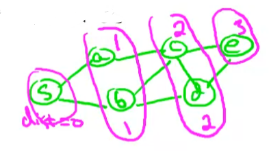
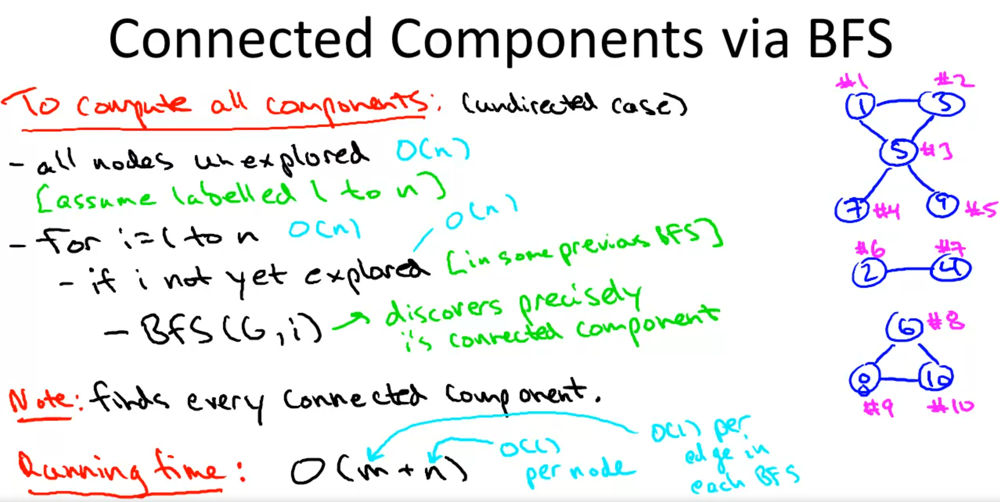
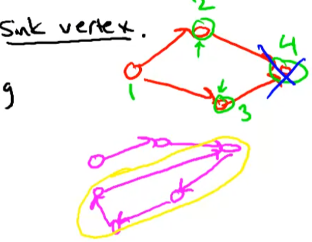
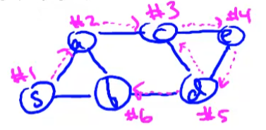
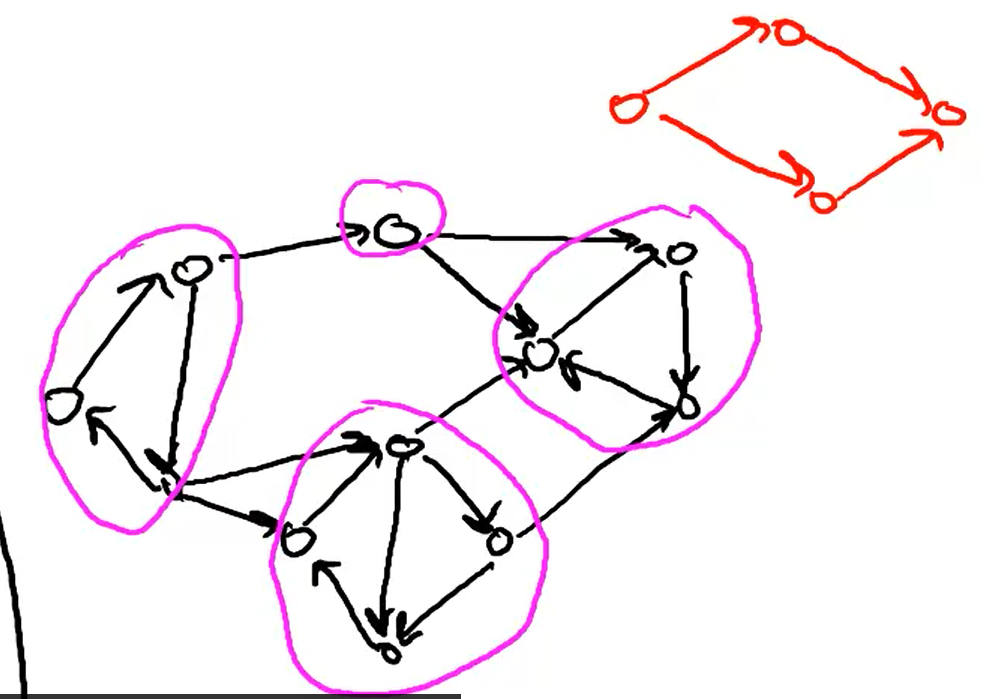

- n vertices,m edges
- degree of vertex is the number of edges that enter it,k denotes maximum degree
- acyclic does not self enclosed loops.(no arrows poitning back if it originates from there)
- BFS (que -FIFO - add top remove bottom-old -go one step each on available vertices,nodes or take steps closer to starting or intiial node) and DFS (stack -LIFO-add-top -remove most recent-last-go deep and go back to last). problem can be solved in O(m+n) time.
- Connected path if there exists atleast one edge.Equivalence relation (path from u to v then there is path from v to u)
- In a graph, if a pair of vertices is connected by more than one edge, then those edges are called parallel edges. 
- shortest-path distance between ss and tt is the fewest number of edges in an ss-tt path
- The diameter of a graph is the maximum eccentricity of any vertex in the graph. That is, it is the greatest distance between any pair of vertices. To find the diameter of a graph, first find the shortest path between each pair of vertices. The greatest length of any of these paths is the diameter of the graph.(The maximum eccentricity of any vertex in a graph G is known as the Diameter of a graph)
- The eccentricity in a connected graph is the maximum distance between a vertex v and any other vertex u of a graph. It is denoted as e(v). In the case of a disconnected graph, the eccentricity of each vertex is infinity.
- The radius of a graph is defined as the minimum eccentricity of any graph vertex. Among all the eccentricities possible in a graph G, the radius of the connected graph is the minimum of all those eccentricities. It is represented as r(G).
- The Center of a graph( Jordan Center) is a set of all vertices with minimum eccentricity. Equivalently it is the set of vertices with eccentricity equal to the graph radius. The vertices lying at the center of a graph minimizes the distance from all other vetices in a graph.
- A directed graph is strongly connected if there is a path between all pairs of vertices
- Movie network actors(minimum hops) undirected graph(clustering-similar to each other-put edges like score etc,internet connectivity check). How many edges(bacon number ) you need to get from one actor to another actor (same movie acted as basis)
- sudoku initial state search to goal state
- sink vertex no outgoing arcs. Directed acyclic graph has a sink vertix

#### BFS
- can compute shortest paths
- can compute connected components of an undirected graph
- Layered graph

- All nodes initially unexplored (graph G, start vertex S)
- mark s as explored
- Let Q = que data struicture (FIFO), initialized with S ,dist = 0
- while Q#pi:
- remove the firt node of q call it v
- for each edge (v,w)
- if w unexplored (one more than distance responsible for discovering it dist(w) = dist(v) +1)
- mark w as explored
- add w to Q (at end)

#### Connected Components

 

#### Topological ordering

- let v be sync vertex of Graph (G).
- set f(v)=n
- recurse on G-{v}

#### DFS

- Directed acyclic graph gives topological ordering. Only forward no backward (f(v) > f(u))
- strongly connected components in Directed acyclic graphs
- Stack (LIFO) constant additions and deletions both at frontend
- DFS-loop (Graph G)- back track recursive indication
- mark all nodes unexplored
- current label = n( to keep track of ordering- no of vertices)
- for each vertex v belongs G
- if v not explored
- DFS (G,V)
- set f(s) = current -label

#### Strongly Connected Components

- SCC induces acyclic (otherwise collapse into each other)
- Equivalence relation satisfying expecially directed graph. Transitive
-  wont have equivalient path from one SCC to another (only one way not both ways)
- The use of strongly connected components is that one could use it to find groups of people who are more closely related in a huge set of data. Think of facebook and how they recommend people that might be your friends...
- DFS invocation starting point is necessary

#### Kosaraju Two Pass Algorithm
- global variable t = 0 (no of nodes processed so far)
- global variable  s =null (current source vertex)
- asume nodes labelled 1 to n
- for i =n down to 1 (top to bottom)
- if i not yet explored
- s =i 
- DFS (G,i)
  - mark i explored
  - set leader(i) =node S
  - for each arc (i,j) £G:
  - if i not explored 
    - DFS (i,j)
  - t++
  - set f(i) =t (finishing time)

